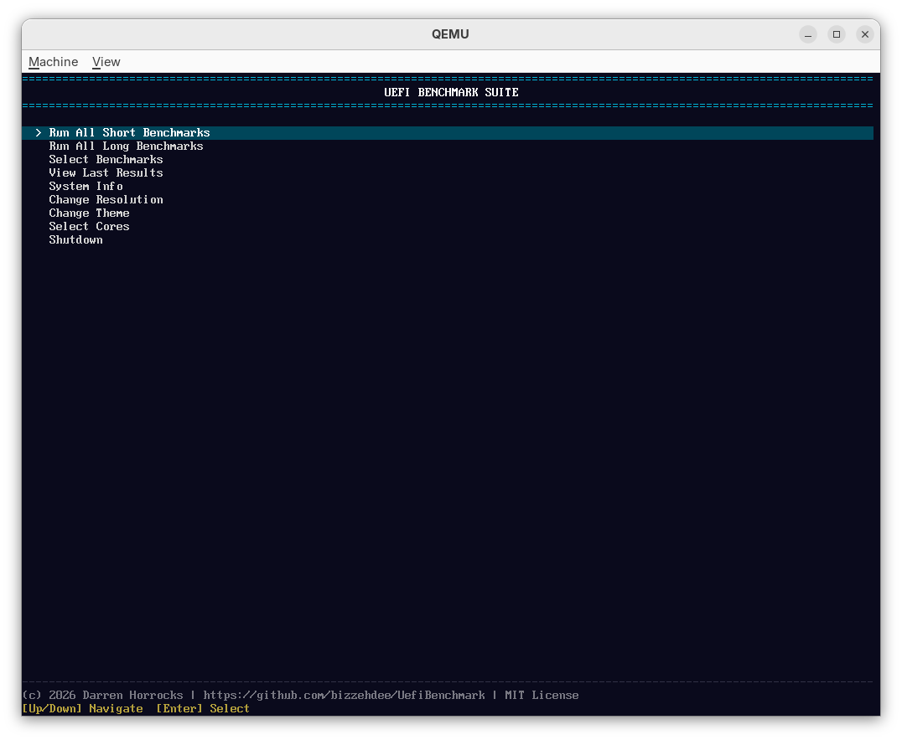
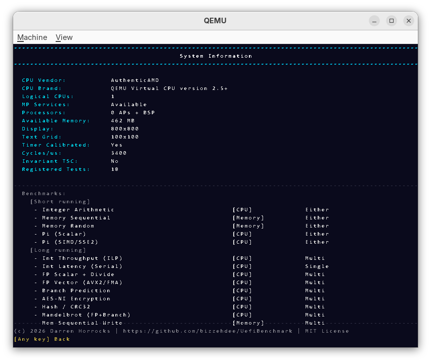
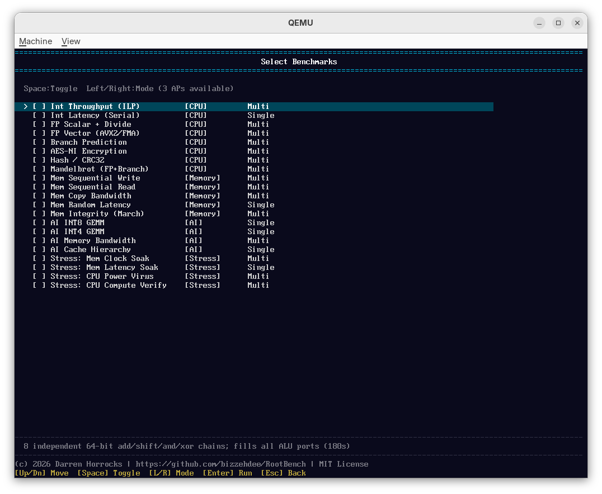
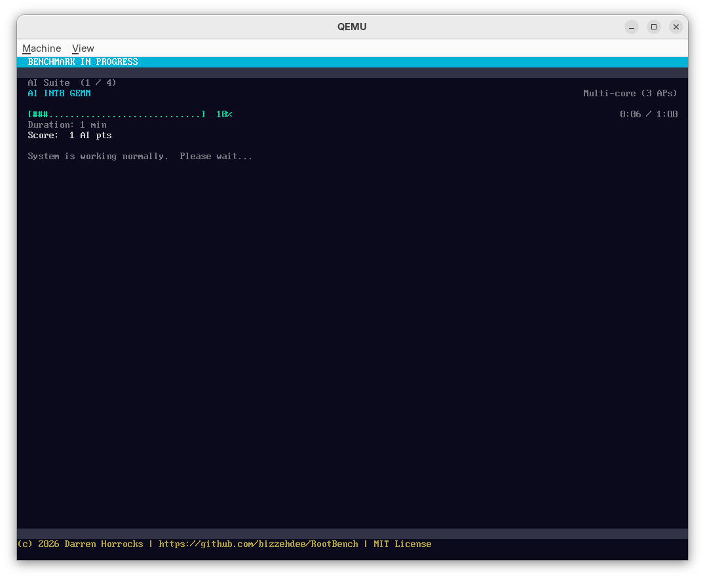
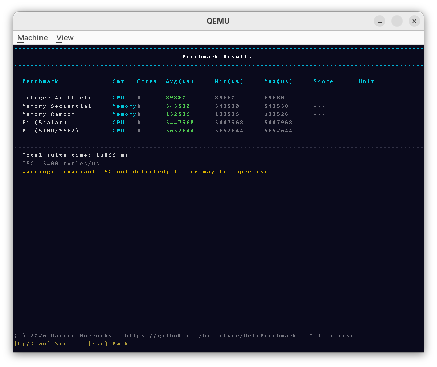
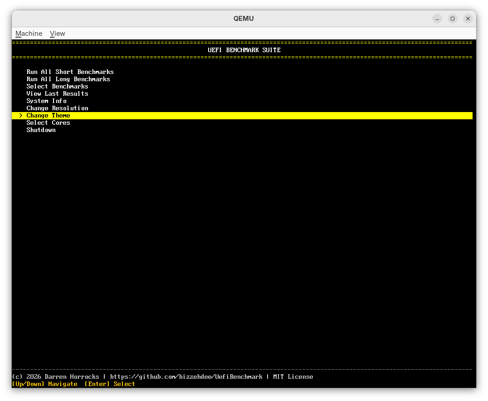
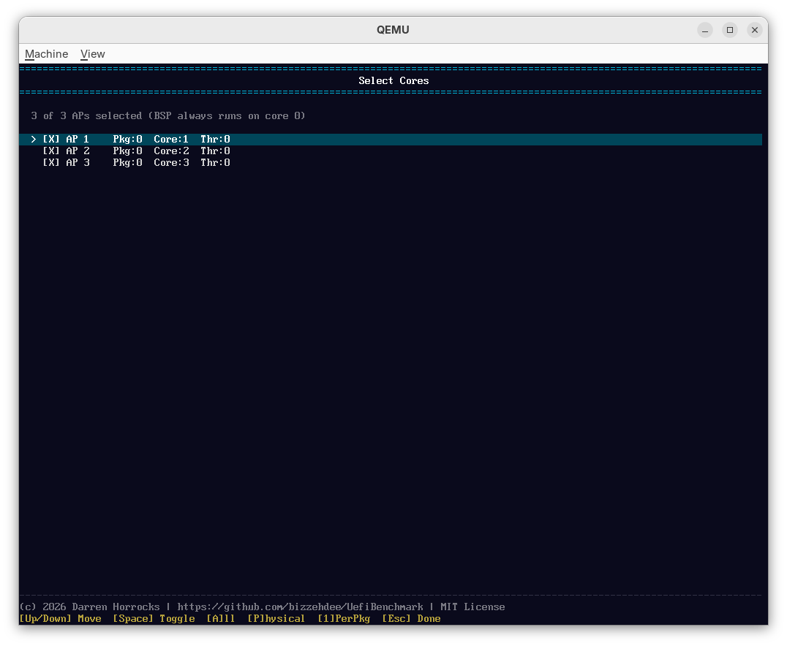
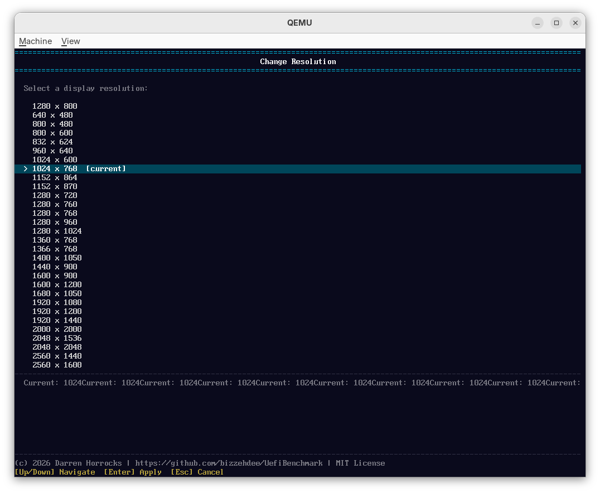

# UEFI Benchmark Suite

A bare-metal benchmark and stability-testing tool that runs **directly on your hardware with no operating system**. It boots from UEFI firmware, talks to the CPU and memory with nothing in the way — no OS scheduler, no background services, no driver overhead — and reports clean, repeatable numbers for CPU, memory, AI-inference readiness, and overclock stability.

Because there is no OS between the benchmark and the silicon, results are far more consistent run-to-run than anything measured from inside Windows or Linux. That makes it ideal for:

- **HPC / performance enthusiasts** chasing peak throughput and clean comparisons.
- **Extreme overclockers** validating that a CPU/RAM tune is actually *stable*, not just bootable.
- **Reviewers** who need known, reproducible metrics with a fixed reference baseline.

---

## Quick Start

### 1. Get the program

Download the latest release — you get two files:

| File | Use it for |
|------|-----------|
| `UefiBenchmark.efi` | USB stick, Ventoy, or VM (the raw UEFI application) |
| `UefiBenchmark.iso` | Bootable disc image for Ventoy, VMs, or burning |

> The released files are **unsigned**, so you must **disable Secure Boot** in your firmware before booting them. If you want to keep Secure Boot enabled, see [Building & Signing Your Own](#building--signing-your-own).

### 2. Boot it

Pick whichever method suits you.

#### USB stick (most common)

1. Format a USB drive as **FAT32**.
2. Copy the application to this exact path on the drive (the location UEFI auto-boots):

   ```
   <USB>/EFI/BOOT/BOOTX64.EFI      ← this is UefiBenchmark.efi, renamed
   ```

3. Reboot and open the firmware boot menu (usually **F12 / F11 / Esc / Del** during POST).
4. Select the USB device. The benchmark launches straight into its menu.

#### Ventoy (drop-in, no reformatting)

[Ventoy](https://www.ventoy.net/) lets you keep multiple boot images on one stick:

1. Install Ventoy onto your USB drive (one-time).
2. Copy **either** file onto the Ventoy partition:
   - `UefiBenchmark.iso` — appears directly in the Ventoy boot menu, **or**
   - `UefiBenchmark.efi` — Ventoy can chainload `.efi` files directly.
3. Boot the stick, pick the entry from Ventoy's menu.

#### Virtual machine

Attach `UefiBenchmark.iso` to any **UEFI-capable** VM (VirtualBox, VMware, Hyper-V, QEMU) and boot from it. Note: VM results are not representative of bare-metal performance — use VMs for trying out the interface, not for real numbers.

### 3. Don't forget

- **Secure Boot must be off** for the prebuilt files.
- Memory tests grab almost all of your RAM — close nothing, there's no OS, but expect the machine to be fully dedicated to the benchmark while it runs.
- To exit, reboot the machine (there's no OS to return to).

---

## Using the App

Everything is keyboard-driven from the main menu. From there you can:

- **Launch a full suite** — run every test in a category (CPU, Memory, AI, Stress) back to back.
- **Select individual benchmarks** — pick exactly which tests to run.
- **Choose how tests run** — single-core, all-core (multi), or *core-cycle* mode (runs each test on every core in turn and reports a per-core table — great for finding one weak core).
- **Pick which cores participate** — hand-select physical cores for multi-core and core-cycle runs.
- **Set runs per benchmark** — 1–10 repeats, with min/max/average reported.
- **Change display settings** — switch resolution live (1024×768 default, up to 1080p) and pick a colour theme (Dark, Light, High-Contrast).
- **View system info** — detected CPU features, memory configuration (SPD timings, speed, channels), and the full test list.

While a test runs you get a **live progress bar**, elapsed/budget time, the current score, and the active core count, all updated in real time.

> **Every test is time-boxed, and the budget is yours to set — anywhere from 1 minute to 24 hours.** Each test runs to a wall-clock time budget rather than a fixed amount of work, and the score is *throughput* (work ÷ time). This means total run time is predictable no matter how fast or slow the hardware is, and two machines are always compared over the same wall-clock window. Short budgets give a quick read; long budgets (up to a full day) are ideal for soak-testing an overclock or warming a machine to steady state before measuring.

---

## The Benchmark Suites

There are four suites. The first three measure performance; the fourth tests stability.

### CPU Suite

Measures raw processor performance across integer, floating-point, branching, and crypto workloads. Runs multi-core by default. (~24 min for the full suite at the default budget; adjustable per test from 1 min to 24 h.)

| Test | What it measures | Score (higher is better) |
|------|------------------|--------------------------|
| **Int Throughput (ILP)** | Peak integer instructions-per-clock using 8 independent ALU chains — rewards wide cores and high clocks | **MOPS** (million ops/sec) |
| **Int Latency (Serial)** | A single dependent chain of integer ops — measures per-operation latency, not width | **MOPS** |
| **FP Scalar + Divide** | Scalar floating-point including the divider and `sqrt` | **MFLOP/s** |
| **FP Vector (AVX2/FMA)** | 256-bit fused multiply-add throughput across 10 vector accumulators — peak SIMD flops | **GFLOP/s** |
| **Branch Prediction** | Data-dependent branches on random data — stresses the branch predictor | **Mbranch/s** |
| **AES-NI Encryption** | Hardware AES-128 round chaining | **MB/s** |
| **Hash / CRC32** | Hardware CRC32 over a cache-resident block | **MB/s** |
| **Mandelbrot (FP + Branch)** | Mixed floating-point and unpredictable branches — a realistic blended workload | **Miter/s** (million iterations/sec) |

### Memory Suite

Exercises the **entire** memory subsystem — every test operates on essentially all of your free RAM, so results reflect true DRAM behaviour, not cache. (~6–10 min at the default budget; adjustable per test from 1 min to 24 h.)

| Test | What it measures | Score |
|------|------------------|-------|
| **Mem Sequential Write** | Streaming (non-temporal) writes — true DRAM write bandwidth | **MB/s** (higher = better) |
| **Mem Sequential Read** | Streaming reads — DRAM read bandwidth | **MB/s** (higher = better) |
| **Mem Copy Bandwidth** | Combined read+write copy (STREAM-style triad) | **MB/s** (higher = better) |
| **Mem Random Latency** | Pointer-chase across all of RAM — full random-access latency | **ns/access** (**lower = better**) |
| **Mem Integrity (March)** | Writes and verifies `0x00/0xFF/0xAA/0x55` patterns over all RAM | **MB/s** + **error count** (0 = no faults) |

### AI Readiness Suite

Estimates how well the machine would run local AI / LLM inference. Every score is **normalised against a reference machine** — an **AMD Ryzen 7 5800X with 64 GB of DDR4-3200**, where each test scores **1000 points**. So 2000 means "twice the reference," 500 means "half." (~6 min at the default budget; adjustable per test from 1 min to 24 h.)

| Test | What it measures | Score |
|------|------------------|-------|
| **AI INT8 Matrix** | INT8×INT8→INT32 matrix-multiply throughput (the core of inference) | **INT8 GOPS** |
| **AI INT4 Matrix** | Packed 4-bit multiply-accumulate — approximates quantised (Q4) LLM weights | **INT4 GOPS** |
| **AI Memory Bandwidth** | Sequential, random, and mixed-stride reads — the usual bottleneck for token generation | **GB/s** |
| **AI Cache Behaviour** | Pointer-chase across 512 KB–64 MB working sets — measures L2/L3/miss latency | **Score / 1000** |

The suite combines these into a single weighted **AI Readiness Score** and an estimated **tokens-per-second** for 7B, 14B, and 32B Q4 models — a quick answer to "can this box run a local LLM, and how fast?"

### Stress Suite

Built for **overclock validation**. Like every other test, the budget is configurable from **1 minute to 24 hours** — set a short run for a quick sanity check or a multi-hour/overnight soak before signing off a 24/7 profile. Crucially, these tests **do not stop on the first error**: faults are counted and shown live so you can see *how* unstable a setting is, not just that it failed once.

| Test | What it stresses | Score |
|------|------------------|-------|
| **Mem Clock Soak** | Sequential write+verify across all RAM — exposes marginal memory-clock stability | **Errors** (0 = stable) |
| **Mem Latency Soak** | Large-stride write+verify that maximises DRAM row activations — stresses timing margins | **Errors** (0 = stable) |
| **CPU Power Virus** | AVX2+FMA all-core heat soak — monitors whether sustained throughput holds under thermal/power load | **GFLOP/s** (watch for it dropping) |
| **CPU Compute Verify** | A 1-million-step deterministic chain checked against a golden value on every core — *any* deviation means a marginal voltage or clock | **Errors** (0 = stable) |

---

## Which Tests Should I Run?

### 🏎️ HPC / Performance Enthusiasts

You want peak numbers and clean comparisons.

- **Run:** the full **CPU Suite** (especially *FP Vector (AVX2/FMA)* and *Int Throughput*) and the **Memory Suite** bandwidth tests.
- **Use core-cycle mode** to confirm every core performs identically.
- **Watch:** GFLOP/s and MB/s for headline throughput; ns/access for latency tuning.
- Bump **runs per benchmark** to 3–5 for tighter averages.

### 🧊 Extreme Overclockers

You care about *stability*, and you want it proven, not assumed.

- **Run:** the entire **Stress Suite**.
  - *CPU Compute Verify* and *Mem Clock Soak* are your primary truth-tellers — **target 0 errors**.
  - *CPU Power Virus* tells you whether clocks hold under sustained AVX load (thermal/power throttling shows up as a falling GFLOP/s).
  - *Mem Latency Soak* catches marginal RAM timings that bandwidth tests miss.
- **Also run** *Mem Integrity (March)* from the Memory Suite as a quick correctness check.
- Dial the per-test budget up to several hours (max 24 h) for an overnight soak before signing off a 24/7 profile.
- Any non-zero error count = not stable. Back off the overclock.

### 📊 Reviewers / Benchmarkers

You need known, reproducible, comparable metrics.

- **Run:** the **CPU**, **Memory**, and **AI Readiness** suites in full — every score is throughput-based and time-boxed, so the same hardware gives the same numbers every time.
- The **AI Readiness Score** is normalised to a fixed reference (Ryzen 7 5800X / 64 GB DDR4-3200 = 1000), giving you an instant cross-platform yardstick and a tokens/sec estimate for LLM articles.
- Capture the **Results Summary** screen for per-test scores plus min/max/avg, and the **System Information** screen for the test environment.
- Because there's no OS, you avoid the background-noise variance that plagues in-OS benchmarks.

---

## Score Metrics Reference

| Metric | Meaning | Better when |
|--------|---------|-------------|
| MOPS | Million operations / sec | Higher |
| MFLOP/s | Million floating-point ops / sec | Higher |
| GFLOP/s | Billion floating-point ops / sec | Higher |
| GOPS | Billion integer ops / sec (AI tests) | Higher |
| MB/s | Megabytes / sec | Higher |
| GB/s | Gigabytes / sec | Higher |
| Mbranch/s | Million branches / sec | Higher |
| Miter/s | Million iterations / sec | Higher |
| ns/access | Nanoseconds per memory access | **Lower** |
| Score/1000 | Normalised vs. reference machine (1000 = reference) | Higher |
| Errors | Count of detected faults | **0 = stable** |

---

## Screenshots

**Main Menu** — Launch a category suite, select individual benchmarks, or access system info and settings.



**System Information** — CPU details, memory configuration (SPD timings, speed, channels), and the registered benchmark list.



**Benchmark Selection** — Choose individual benchmarks and toggle single-core / multi-core / core-cycle mode per benchmark.



**Progress Display** — Live progress bar, elapsed/budget time, current score, and core count during a long benchmark.



**Results Summary** — Per-benchmark scores, min/max/avg run times, and per-core breakdown for core-cycle runs.



**High Contrast Theme** — High-contrast dark palette for improved visibility.



**Core Selection** — Select exactly which physical cores participate in multi-core and core-cycle runs.



**Resolution Selection** — Switch display resolution live from the main menu.



---

## Building & Signing Your Own

You only need this if you want to **keep Secure Boot enabled** (the prebuilt downloads are unsigned), or build from source.

The build process can sign the `.efi` automatically with your own key, but **signing alone isn't enough** — your certificate also has to be *enrolled* into the firmware so it trusts the binary.

### Build + sign

The Makefile auto-detects your platform (native LLVM on Linux; the MSYS2 **MINGW64** shell on Windows). Signing is **on by default**.

**Debian / Ubuntu:**

```bash
sudo apt update
sudo apt install clang lld llvm make \
                 mtools dosfstools ovmf qemu-system-x86 xorriso \
                 sbsigntool openssl mokutil
make            # builds and signs UefiBenchmark.efi (a key is auto-generated on first run)
make iso        # bootable signed ISO
make qemu       # try it in QEMU
```

**Fedora:** same as above, but `sudo dnf install clang lld llvm make mtools dosfstools edk2-ovmf qemu-system-x86 xorriso sbsigntools openssl mokutil`.

On first build a self-signed key/cert pair is generated automatically (no passphrase, zero interaction). To use your own:

```bash
make SB_KEY=/path/to/db.key SB_CERT=/path/to/db.crt
```

To build **unsigned** (the same as the downloads):

```bash
make SIGN=0
```

### Enroll the certificate so Secure Boot accepts it

On real hardware, enroll via MOK (Machine Owner Key):

```bash
make enroll          # queues your cert for import
                     # then REBOOT — MokManager appears; choose "Enroll MOK"
                     # and enter the password you set (physical-presence confirmation
                     # is required by design and cannot be skipped)
make enroll-status   # check what's enrolled / pending
make enroll-info     # full instructions, including the QEMU/OVMF path
```

Once the certificate is enrolled in your firmware's `db` (or as a MOK), the signed `.efi` will boot with Secure Boot **on**.

---

## Contributing a New Benchmark Test

New tests are welcome. A benchmark is a small C++ class that extends **`LongBenchmarkBase`** (which provides the live progress callback and AP-safe render locking). It declares its identity (name, description, category), how it runs (threading mode), and how it scores (value + unit). Almost everything else has a sensible default you can leave alone.

### Pick your budget source

Time-boxed tests no longer hardcode a duration — they read the user's configured budget from `RunConfig`, which is settable from 1 minute to 24 hours in the app:

- **Performance tests** (CPU / Memory / AI): `RunConfig::GetTestBudgetUs()`
- **Stress / soak tests**: `RunConfig::GetStressBudgetUs()`

### Header

```cpp
// Source/Benchmarks/MyBenchmark.h
#pragma once
#include "LongBenchmarkBase.h"
#include "RunConfig.h"

class MyBenchmark : public LongBenchmarkBase {
public:
    const char* GetName()        const override { return "My Benchmark"; }
    const char* GetDescription() const override { return "What it measures"; }
    const char* GetCategory()    const override { return "CPU"; }   // CPU / Memory / AI / Stress

    // Multi-core only, single-core only, or user's choice (Either).
    ThreadingMode GetThreadingMode() const override { return ThreadingMode::Either; }

    // Read the user-configured budget — DON'T hardcode a duration.
    UINT64      GetBudgetUs() const override { return RunConfig::GetTestBudgetUs(); }
    UINT64      GetScore()    const override { return mTotalIter / GetBudgetUs(); }
    const char* GetUnit()     const override { return "MOPS"; }

    void PreRun()  override { mTotalIter = 0; }          // reset accumulator before each run
    void Run()     override { RunCore(0, 1); }           // single-core entry point
    void RunCore(UINT32 workerIndex, UINT32 totalWorkers) override;  // multi-core entry point

private:
    volatile UINT64 mTotalIter = 0;
};
```

### Implementation

```cpp
// Source/Benchmarks/MyBenchmark.cpp
#include "MyBenchmark.h"
#include "TimeBox.h"

void MyBenchmark::RunCore(UINT32 workerIndex, UINT32 totalWorkers) {
    (void)workerIndex; (void)totalWorkers;   // use these to partition work across cores
    UINT64 local = TimeBox::RunWithProgress(GetBudgetUs(), /*chunk*/ 100000,
        [](UINT64 n) { /* the work to measure */ },
        [this](UINT64 e, UINT64) { TryReportProgress(e); });
    __atomic_fetch_add(const_cast<UINT64*>(&mTotalIter), local, __ATOMIC_RELAXED);
}
```

### Useful optional overrides

| Override | Default | Use it to |
|----------|---------|-----------|
| `GetThreadingMode()` | `Either` | Force `SingleOnly` or `MultiOnly` if the test only makes sense one way |
| `IncludeInCategoryScore()` | `true` | Return `false` for pass/fail tests (integrity, stress-verify) so they don't skew the category composite |
| `GetCategoryWeight()` | `100` | Set a 0–100 relative weight in the category's composite score |
| `GetStatus()` | `nullptr` | Return a live sub-phase label (e.g. the current test pattern) shown during the run |

### Wire it up

1. Instantiate it and call `BenchmarkRegistry::Register(&myBench)` in `Source/Main.cpp` (next to the other registrations).
2. Add the `.cpp` to `SOURCES` in the `Makefile`.
3. Add it to `[Sources]` in `UefiBenchmark.inf`.

The new test (and its category, if new) appears automatically in the menus. Two hard rules: code in `RunCore` runs on application processors and must be **pure computation — no UEFI calls** — and the static registry holds a maximum of **32 benchmarks**.
